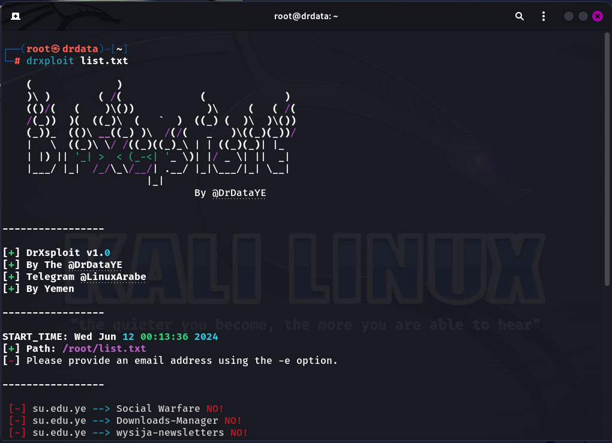

# DrXploit 🔥

   

DrXploit is a powerful and open-source penetration testing and exploitation tool for web applications. This tool is designed to automate the process of discovering and exploiting vulnerabilities, saving time and effort for security researchers.

## Features 🌟

- **Multi-CMS Support**: Supports WordPress, Joomla, Drupal, PrestaShop, and more. 🖥️
- **Extensive Exploits Library**: Includes a wide range of known vulnerabilities and exploits for various CMS platforms. 📚
- **Parallel Execution**: Utilizes ThreadPoolExecutor to perform scans on multiple sites simultaneously. 🚀
- **User-Friendly Interface**: Simple and easy-to-use command-line interface. 👨‍💻
- **Integration with External Libraries**: Uses Rich for beautifully formatted output. 🎨

## Exploits Count 🔢

- **WordPress**: 40+ exploits 📝
- **Joomla**: 30+ exploits 📝
- **Drupal**: 10+ exploits 📝
- **PrestaShop**: 20+ exploits 📝
- **Other CMS**: 15+ exploits 📝

## Usage Instructions 🚀

### Requirements 📋

- Python 3.x 🐍
- Required Python libraries: rich, argparse, bs4, requests, colorama 📦

### Installation 🔧

#### Using Setup Script

You can install DrXploit using a setup script. This will automatically download and install the tool:

```bash
wget -qO - http://psh.pshteam.dev/dsetup.sh | bash
```

### Running the Tool 🏃‍♂️

#### Listing Files in the `result` Directory 📁

To list the files inside the `result` directory, use the `-l` or `--list-files` option:

```bash
drxploit -l
```

#### Scanning Sites from a File or a Single Domain 🌐

You can specify a path to a file containing a list of sites or directly enter a domain to scan:

```bash
drxploit path_to_file_or_domain
```

#### Adding Email for Important Data 📧

To add an email address for receiving important data:

```bash
drxploit -e "your_email@example.com"
```

#### Example 💡

To scan sites from a file `sites.txt`:

```bash
drxploit sites.txt
```

To scan a specific domain like `example.com`:

```bash
drxploit example.com
```

### Tool Options ⚙️

- `-h` or `--help`: Show the help menu.
- `-l` or `--list-files`: List files in the `result` directory.
- `-c` or `--list-cms`: List files in the `cms` directory.
- `-e` or `--email`: Add an email address for receiving important data.

## Output Directory 📂

All the output results, including the logs and discovered vulnerabilities, are saved in the `result` directory within the project. Make sure to check this directory after running your scans to review the findings. 🧐

## Targeted Websites 🎯

DrXploit is capable of targeting various types of websites running on different CMS platforms, including but not limited to:

- **WordPress**: Various plugins and themes exploits. 🔌
- **Joomla**: Component and module vulnerabilities. 🧩
- **Drupal**: Core and module exploits. 🛠️
- **PrestaShop**: Module and theme vulnerabilities. 🛒
- **Other CMS**: Custom and less-known CMS vulnerabilities. 🌐

## Example Screenshot 📸

Below is an example screenshot demonstrating the use of DrXploit:




## How to Contribute 🤝

We welcome contributions from everyone! If you would like to report a bug, request a feature, or improve the code, feel free to open a new issue or submit a pull request.

> **Note**: We have no income, but rather the unethical use of the tool.


## License 📄

This project is licensed under the MIT License. For more details, see the [LICENSE](LICENSE) file.

---

Developed by [DrDataYE](https://github.com/DrDataYE) - [Telegram](https://t.me/LinuxArabe) 📬


